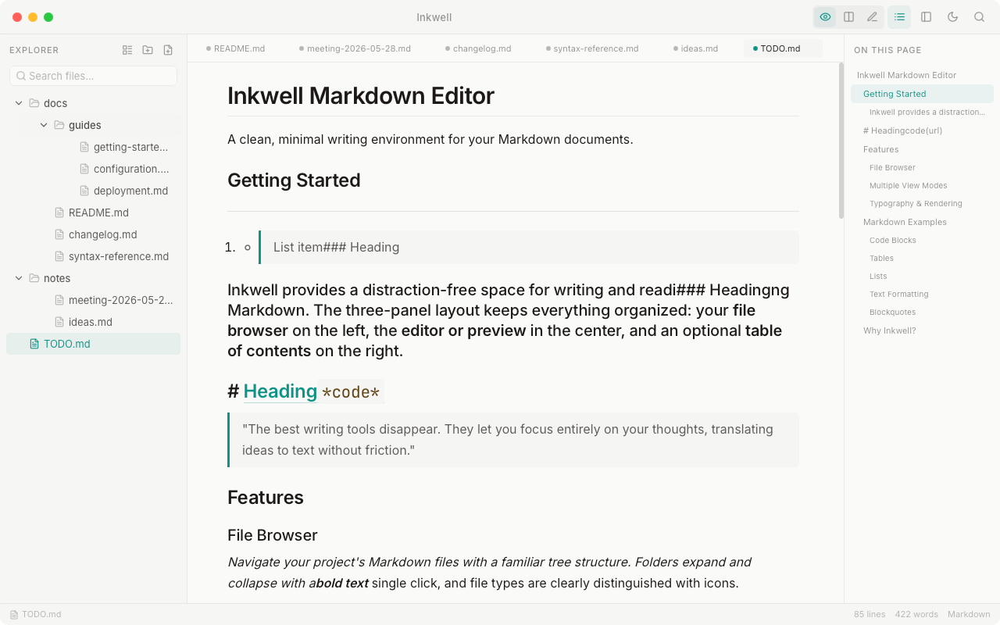

<p align="center">
  
</p>

<h1 align="center">Inkwell MD</h1>

<p align="center">
  <strong>A clean, distraction-free Markdown editor for your desktop.</strong><br/>
  Built with Tauri v2 + React — fast, native, and beautifully minimal.
</p>

<p align="center">
  <strong>一款简洁、专注的桌面 Markdown 编辑器。</strong><br/>
  基于 Tauri v2 + React 构建 — 轻量原生，极简之美。
</p>

<p align="center">
  
  
  
  
  
</p>

<p align="center">
  <a href="#why-inkwell">English</a> · <a href="#为什么选择-inkwell">中文</a>
</p>

---

<p align="center">
  
</p>

---

# English

## Why Inkwell?

Most Markdown editors try to do too much. Inkwell takes a different approach — **show only what you need, when you need it**. The sidebar appears when you're navigating, the table of contents helps when documents get long, and everything else fades away, leaving you with nothing but your words.

## Features

- **Three View Modes** — Reading, Split, and Editor. Switch with `Cmd+E`.
- **Live GFM Rendering** — Tables, task lists, strikethrough, autolinks via `remark-gfm`.
- **Syntax Highlighting** — Prism-powered code blocks that follow your theme (light/dark).
- **Inline HTML** — Renders raw HTML in Markdown; opens standalone `.html` files too.
- **Smart TOC** — Auto-generated table of contents with click-to-jump and scroll spy.
- **File Browser** — Tree view + flat path view with instant search.
- **File Watching** — Detects external file changes and auto-refreshes via Tauri's `notify` watcher.
- **Command Palette** — `Cmd+K` to search files and execute commands instantly.
- **Formatting Toolbar** — Quick-insert for Bold, Italic, Code, Links, Headings, and more.
- **Light & Dark Themes** — Seed-token design system with smooth transitions. `Cmd+/` to toggle.
- **Multi-tab Editing** — Work across multiple documents simultaneously.
- **External Link Safety** — Confirmation dialog before opening links in your browser.
- **Native Desktop App** — Lightweight `.app` / `.dmg` via Tauri, no Electron overhead.

## Keyboard Shortcuts

| Shortcut | Action |
|----------|--------|
| `Cmd+O` | Open file |
| `Cmd+Shift+O` | Open folder |
| `Cmd+E` | Cycle view modes (Read → Split → Edit) |
| `Cmd+B` | Toggle sidebar |
| `Cmd+K` | Command palette |
| `Cmd+/` | Toggle light/dark theme |
| `Cmd+S` | Save current file |

## Tech Stack

| Layer | Technology |
|-------|-----------|
| Desktop | **Tauri v2** (Rust backend) |
| Frontend | **React 18** + **Vite 6** |
| Markdown | `react-markdown` + `remark-gfm` + `rehype-slug` + `rehype-raw` |
| Code Blocks | `react-syntax-highlighter` (Prism, One Light / One Dark) |
| Icons | `lucide-react` |
| TOC Sync | `github-slugger` |
| File Watching | `notify` crate (Rust) |

## Getting Started

### Prerequisites

- [Node.js](https://nodejs.org/) 18+
- [Rust](https://www.rust-lang.org/tools/install) 1.70+ (for Tauri build)

### Development

```bash
git clone https://github.com/bitshift-byte/md-reader.git
cd md-reader
npm install
npm run dev
```

### Build Desktop App

```bash
cargo tauri build
```

Produces `.app` and `.dmg` in `src-tauri/target/release/bundle/`.

## Project Structure

```
md-reader/
├── src/
│   ├── App.jsx              # Main application component
│   ├── main.jsx             # React entry point
│   ├── styles.css           # Seed-token design system
│   ├── tauri-bridge.js      # Tauri API isolation layer
│   └── assets/              # Static assets
├── src-tauri/
│   ├── src/
│   │   ├── main.rs          # Tauri entry point
│   │   ├── lib.rs           # App builder & watcher state
│   │   └── commands.rs      # Tauri commands (read/write/watch)
│   ├── capabilities/        # Permission configuration
│   └── Cargo.toml           # Rust dependencies
├── docs/                    # Documentation & screenshots
├── icon.png                 # Application icon
├── index.html               # HTML entry point
└── vite.config.js           # Vite configuration
```

## Design System

Inkwell MD uses a **seed-token CSS custom property** system. All visual tokens (borders, shadows, surfaces, hover states) are derived from a small set of seed values via `color-mix()` and `calc()`:

```
--seed-bg        Base background
--seed-fg        Base foreground
--seed-primary   Primary UI color
--seed-accent    Accent / highlight color
--seed-surface   Elevated surfaces
--seed-radius    Border radius scale
```

Toggle between light and dark themes — every derived token transitions smoothly.

---

# 中文

## 为什么选择 Inkwell?

大多数 Markdown 编辑器都试图做太多事情。Inkwell 采取了不同的方式 — **只在需要时，展示你需要的内容**。导航时侧边栏出现，文档较长时目录自动呈现，其余一切隐去，只留下你的文字。

## 功能特性

- **三种视图模式** — 阅读、分屏、编辑，`Cmd+E` 一键切换
- **GFM 实时渲染** — 表格、任务列表、删除线、自动链接，基于 `remark-gfm`
- **语法高亮** — Prism 驱动的代码块，自动跟随明暗主题
- **内嵌 HTML** — 渲染 Markdown 中的原始 HTML，也支持直接打开 `.html` 文件
- **智能目录** — 自动生成目录，支持点击跳转和滚动高亮
- **文件浏览器** — 树形视图 + 扁平路径视图，支持即时搜索
- **文件监听** — 通过 Tauri `notify` 监听外部文件变更并自动刷新
- **命令面板** — `Cmd+K` 快速搜索文件和执行命令
- **格式化工具栏** — 快速插入粗体、斜体、代码、链接、标题等
- **明暗主题** — Seed Token 设计系统，平滑过渡，`Cmd+/` 切换
- **多标签编辑** — 同时处理多个文档
- **外链安全** — 在浏览器中打开链接前弹出确认对话框
- **原生桌面应用** — 基于 Tauri 打包轻量级 `.app` / `.dmg`，无 Electron 开销

## 快捷键

| 快捷键 | 操作 |
|--------|------|
| `Cmd+O` | 打开文件 |
| `Cmd+Shift+O` | 打开文件夹 |
| `Cmd+E` | 切换视图模式（阅读 → 分屏 → 编辑） |
| `Cmd+B` | 切换侧边栏 |
| `Cmd+K` | 命令面板 |
| `Cmd+/` | 切换明暗主题 |
| `Cmd+S` | 保存当前文件 |

## 技术栈

| 层级 | 技术 |
|------|------|
| 桌面框架 | **Tauri v2**（Rust 后端） |
| 前端 | **React 18** + **Vite 6** |
| Markdown | `react-markdown` + `remark-gfm` + `rehype-slug` + `rehype-raw` |
| 代码高亮 | `react-syntax-highlighter`（Prism，One Light / One Dark） |
| 图标 | `lucide-react` |
| 目录同步 | `github-slugger` |
| 文件监听 | `notify` crate（Rust） |

## 快速开始

### 环境要求

- [Node.js](https://nodejs.org/) 18+
- [Rust](https://www.rust-lang.org/tools/install) 1.70+（用于 Tauri 构建）

### 开发

```bash
git clone https://github.com/bitshift-byte/md-reader.git
cd md-reader
npm install
npm run dev
```

### 打包桌面应用

```bash
cargo tauri build
```

产出 `.app` 和 `.dmg` 位于 `src-tauri/target/release/bundle/`。

## 项目结构

```
md-reader/
├── src/
│   ├── App.jsx              # 主应用组件
│   ├── main.jsx             # React 入口
│   ├── styles.css           # Seed Token 设计系统
│   ├── tauri-bridge.js      # Tauri API 隔离层
│   └── assets/              # 静态资源
├── src-tauri/
│   ├── src/
│   │   ├── main.rs          # Tauri 入口
│   │   ├── lib.rs           # App Builder 与 Watcher 状态
│   │   └── commands.rs      # Tauri 命令（读/写/监听）
│   ├── capabilities/        # 权限配置
│   └── Cargo.toml           # Rust 依赖
├── docs/                    # 文档与截图
├── icon.png                 # 应用图标
├── index.html               # HTML 入口
└── vite.config.js           # Vite 配置
```

## 设计系统

Inkwell MD 使用 **Seed Token CSS 自定义属性** 系统。所有视觉 Token（边框、阴影、表面、悬停状态）均通过 `color-mix()` 和 `calc()` 从少量种子值派生：

```
--seed-bg        基础背景色
--seed-fg        基础前景色
--seed-primary   主色调
--seed-accent    强调色 / 高亮色
--seed-surface   浮层表面色
--seed-radius    圆角缩放基准
```

切换明暗主题时，所有派生 Token 平滑过渡。

## 许可证

[MIT](LICENSE)

---

<p align="center">
  <em>Built with care · <a href="https://github.com/bitshift-byte/md-reader">github.com/bitshift-byte/md-reader</a></em>
</p>
