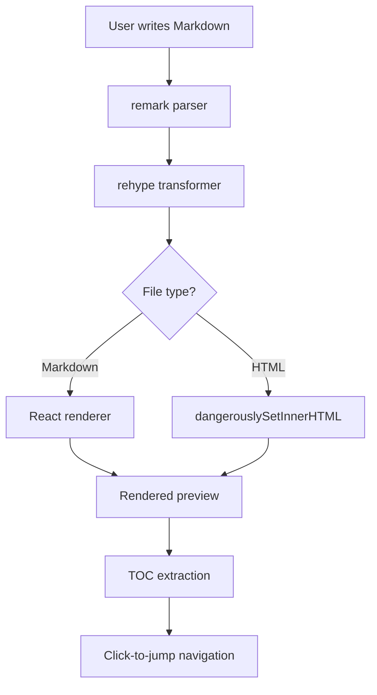

# Markdown Syntax Reference

> A comprehensive showcase of every Markdown feature supported by Inkwell MD.
> Use this document to verify rendering, test themes, and explore the editor's capabilities.

---

## 1. Headings

# Heading Level 1
## Heading Level 2
### Heading Level 3
#### Heading Level 4
##### Heading Level 5
###### Heading Level 6

Headings from H1 through H6 are rendered with decreasing size and increasing letter-spacing. The table of contents on the right automatically captures all heading levels.

---

## 2. Text Formatting

Markdown provides a rich set of inline formatting options:

- **Bold text** using double asterisks
- *Italic text* using single asterisks
- ***Bold and italic*** using triple asterisks
- ~~Strikethrough~~ using double tildes (GFM)
- `Inline code` using backticks
- You can also ***~~combine all styles~~*** together

Underscore variants also work: _italic with underscores_, __bold with underscores__, and ___both___.

---

## 3. Links & References

### Standard Links

[Tauri Framework](https://tauri.app "The Tauri cross-platform framework")

### Autolinks

<https://github.com/bitshift-byte/inkwell-md>

### Reference-Style Links

This project uses [React][react-link] for the frontend and [Vite][vite-link] for building.

[react-link]: https://react.dev "React — The library for web UIs"
[vite-link]: https://vite.dev "Vite — Next Generation Frontend Tooling"

### Relative Links

See the [Getting Started guide](#getting-started) or jump to [Code Blocks](#8-code-blocks).

---

## 4. Images

### Standard Image


### Linked Image

[](https://github.com/bitshift-byte/inkwell-md)

### Image with Surrounding Text

The Inkwell logo is a hand-drawn illustration of a quill and inkwell, reflecting the app's focus on the *craft of writing*. Here it is inline: the icon  marks Markdown files in the sidebar.

---

## 5. Lists

### Unordered List

- First item
- Second item
  - Nested item A
  - Nested item B
    - Deep nested item
    - Another deep item
  - Back to second level
- Third item

### Ordered List

1. Install prerequisites
2. Clone the repository
   1. Via HTTPS
   2. Via SSH
   3. Via GitHub CLI
3. Install dependencies
4. Start development server

### Task List (GFM)

- [x] Design the application icon
- [x] Implement file tree browser
- [x] Add three view modes (Read / Split / Edit)
- [x] Table of contents with click-to-jump
- [x] Light and dark theme support
- [x] File system watching via Tauri
- [ ] PDF export functionality
- [ ] Plugin system for custom renderers
- [ ] Multi-language UI localization

---

## 6. Blockquotes

> "The best writing tools disappear. They let you focus entirely on your thoughts,
> translating ideas to text without friction."
>
> — Inkwell MD Design Philosophy

### Nested Blockquotes

> Outer quote level
>
> > Inner quote level
> >
> > > Deepest quote level
> > >
> > > "Simplicity is the ultimate sophistication." — Leonardo da Vinci
> >
> > Back to second level
>
> Back to first level

### Blockquote with Mixed Content

> **Important Notice**
>
> This blockquote contains:
>
> 1. An ordered list
> 2. With `inline code`
> 3. And a code block:
>
> ```bash
> npm run build
> ```
>
> ---
>
> And even a horizontal rule!

---

## 7. Tables (GFM)

### Basic Table

| Feature | Status | Priority |
|---------|:------:|----------|
| File Browser | ✅ Done | P0 |
| Markdown Preview | ✅ Done | P0 |
| TOC Navigation | ✅ Done | P1 |
| File Watching | ✅ Done | P1 |
| PDF Export | 🔲 Planned | P2 |

### Complex Table

| Shortcut | macOS | Windows/Linux | Description |
|----------|-------|---------------|-------------|
| `Cmd/Ctrl + O` | ✅ | ✅ | Open a file |
| `Cmd/Ctrl + Shift + O` | ✅ | ✅ | Open a folder |
| `Cmd/Ctrl + E` | ✅ | ✅ | Cycle view modes |
| `Cmd/Ctrl + B` | ✅ | ✅ | Toggle sidebar |
| `Cmd/Ctrl + K` | ✅ | ✅ | Command palette |
| `Cmd/Ctrl + /` | ✅ | ✅ | Toggle theme |
| `Cmd/Ctrl + S` | ✅ | ✅ | Save current file |

### Table with Alignment

| Left Aligned | Center Aligned | Right Aligned |
|:-------------|:--------------:|--------------:|
| Text flows to the left | Text is centered | Text aligns right |
| Useful for names | Good for status | Ideal for numbers |
| Markdown | ✅ Supported | v0.1.0 |

---

## 8. Code Blocks

### Inline Code

Use `React.useState()` to manage state and `useEffect()` for side effects. The `github-slugger` library ensures heading IDs match between the TOC and rendered content.

### JavaScript

```javascript
import GithubSlugger from "github-slugger";

function extractHeadings(markdown) {
  const slugger = new GithubSlugger();
  const headings = [];

  markdown.split("\n").forEach(line => {
    const match = line.match(/^(#{1,6})\s+(.+)/);
    if (match) {
      headings.push({
        level: match[1].length,
        text: match[2],
        id: slugger.slug(match[2]),
      });
    }
  });

  return headings;
}
```

### Rust

```rust
use tauri::Manager;
use std::collections::HashMap;
use std::sync::Mutex;
use notify::RecommendedWatcher;

pub struct WatcherState {
    pub watchers: Mutex<HashMap<String, RecommendedWatcher>>,
}

#[tauri::command]
fn read_file(path: String) -> Result<String, String> {
    std::fs::read_to_string(&path)
        .map_err(|e| format!("Failed to read {}: {}", path, e))
}

fn main() {
    tauri::Builder::default()
        .manage(WatcherState {
            watchers: Mutex::new(HashMap::new()),
        })
        .invoke_handler(tauri::generate_handler![read_file])
        .run(tauri::generate_context!())
        .expect("error while running tauri application");
}
```

### CSS

```css
:root {
  --seed-bg: #FAFAF9;
  --seed-fg: #1C1917;
  --seed-primary: #0D9488;
  --seed-accent: #F59E0B;
  --seed-surface: #F5F5F4;
  --seed-radius: 8px;
}

[data-theme="dark"] {
  --seed-bg: #1C1917;
  --seed-fg: #FAFAF9;
  --seed-primary: #2DD4BF;
  --seed-accent: #FBBF24;
  --seed-surface: #292524;
}

.sidebar {
  background: color-mix(in srgb, var(--seed-surface) 70%, var(--seed-bg));
  border-right: 1px solid color-mix(in srgb, var(--seed-fg) 8%, transparent);
}
```

### JSON

```json
{
  "name": "inkwell-md",
  "version": "0.1.0",
  "private": true,
  "type": "module",
  "scripts": {
    "dev": "vite",
    "build": "vite build",
    "preview": "vite preview"
  },
  "dependencies": {
    "react": "^18.3.1",
    "react-dom": "^18.3.1",
    "react-markdown": "^9.0.1",
    "remark-gfm": "^4.0.0",
    "rehype-slug": "^6.0.0",
    "rehype-raw": "^7.0.0",
    "github-slugger": "^2.0.0",
    "lucide-react": "^0.468.0"
  }
}
```

### Shell

```bash
# Clone and set up the project
$ git clone https://github.com/bitshift-byte/inkwell-md.git
$ cd md-reader

# Install dependencies
$ npm install

# Start development server
$ npm run dev

  VITE v6.4.2  ready in 100 ms

  ➜  Local:   http://127.0.0.1:5173/
  ➜  Network: http://192.168.1.42:5173/

# Build for production
$ npm run build
✓ 1876 modules transformed.
✓ built in 1.42s
```

### Python

```python
from pathlib import Path
import re

def extract_headings(markdown_text: str) -> list[dict]:
    """Extract all headings from a Markdown string."""
    pattern = re.compile(r"^(#{1,6})\s+(.+)$", re.MULTILINE)
    headings = []

    for match in pattern.finditer(markdown_text):
        headings.append({
            "level": len(match.group(1)),
            "text": match.group(2).strip(),
        })

    return headings

if __name__ == "__main__":
    doc = Path("README.md").read_text()
    for h in extract_headings(doc):
        indent = "  " * (h["level"] - 1)
        print(f"{indent}- {h['text']}")
```

### Diff

```diff
- const { invoke } = await import("@tauri-apps/api/core");
+ const { invoke } = await import(/* @vite-ignore */ "@tauri-apps/api/core");

  export function isTauri() {
-   return !!window.__TAURI__;
+   return typeof window !== "undefined" && !!window.__TAURI_INTERNALS__;
  }
```

---

## 9. Horizontal Rules

Three different styles produce the same result:

---

***

___

---

## 10. Inline HTML

### HTML Tags

This paragraph includes <mark>highlighted text</mark>, <sub>subscript</sub>, <sup>superscript</sup>, and keyboard shortcuts: <kbd>Cmd</kbd>+<kbd>S</kbd> to save.

Text can also be <small>smaller</small>, <del>deleted</del>, <ins>inserted</ins>, or <abbr title="HyperText Markup Language">HTML</abbr> with tooltips.

### Collapsible Sections

<details>
<summary>Click to expand: Build Output</summary>

The production build produces optimized assets:

| File | Size | Gzipped |
|------|------|---------|
| index.js | 586 KB | 176 KB |
| index.css | 23 KB | 4.5 KB |

Build completed in **1.42 seconds**.

</details>

<details>
<summary>Click to expand: Environment Setup</summary>

Required tools:

1. **Node.js** — v18+ (LTS recommended)
2. **Rust** — v1.70+ via [rustup](https://rustup.rs)
3. **Xcode CLT** (macOS) or **MSVC** (Windows)

```bash
# Verify installations
node --version   # v18.x or later
rustc --version  # 1.70+
cargo --version  # 1.70+
```

</details>

### Centered Content

<div align="center">

**Inkwell MD** — *Where ideas meet the page.*

*Built with Tauri, React, and care.*

</div>

---

## 11. Footnotes

Markdown supports footnotes for academic writing and citations.[^1] You can also use named footnotes for clarity.[^tauri-note]

[^1]: Footnotes appear at the bottom of the rendered document, with back-links to the reference point.
[^tauri-note]: Tauri v2 is the second major version of the Tauri framework, featuring improved security and plugin architecture.

    Footnotes can span multiple paragraphs with proper indentation.

---

## 12. Emoji Shortcodes (GFM)

Common emoji shortcodes: :smile: :heart: :thumbsup: :rocket: :books: :computer: :memo: :sparkles: :bulb: :warning: :white_check_mark: :x:

Platform-specific: :apple: :penguin: :windows:

---

## 13. Complex Nested Structures

### List with Code and Quotes

1. **Set up the project**

   Create a new Tauri application:

   ```bash
   npm create tauri-app@latest inkwell-md
   cd inkwell-md
   ```

   > **Note:** Choose "React" as the frontend framework and "JavaScript" as the language.

2. **Configure the build**

   Edit `vite.config.js`:

   ```javascript
   import { defineConfig } from "vite";
   import react from "@vitejs/plugin-react";

   export default defineConfig({
     plugins: [react()],
     server: {
       strictPort: true,
       port: 5173,
     },
   });
   ```

3. **Verify the setup**

   | Check | Command | Expected |
   |-------|---------|----------|
   | Node.js | `node -v` | v18+ |
   | Rust | `rustc -V` | 1.70+ |
   | Dev server | `npm run dev` | Port 5173 |

### Blockquote with Everything

> **Release Notes — v0.1.0**
>
> We're excited to announce the first release of Inkwell MD!
>
> ### What's New
>
> - [x] Full GFM support
> - [x] Three view modes
> - [x] File watching
> - [ ] Plugin system *(coming soon)*
>
> ### Code Sample
>
> ```jsx
> <ReactMarkdown
>   remarkPlugins={[remarkGfm]}
>   rehypePlugins={[rehypeSlug, rehypeRaw]}
> >
>   {content}
> </ReactMarkdown>
> ```
>
> ### Platform Support
>
> | Platform | Status |
> |----------|--------|
> | macOS | ✅ Supported |
> | Windows | ✅ Supported |
> | Linux | ⚠️ Untested |
>
> > "Simplicity is the soul of efficiency." — Austin Freeman

---

## 14. Special Characters & Edge Cases

### HTML Entities

Copyright: &copy; 2026 Inkwell MD — Trademark: &trade;

Arrows: &rarr; &larr; &uarr; &darr; &harr;

Mathematical: &le; &ge; &ne; &plusmn; &infin; &sum; &prod;

Greek: &alpha; &beta; &gamma; &delta; &pi; &omega;

### Escaped Characters

\*This is not italic\*
\`This is not code\`
\# This is not a heading
\- This is not a list item
\[This is not a link\](url)

### Very Long Line

This is an intentionally long line to test text wrapping behavior in the editor and preview panes. The quick brown fox jumps over the lazy dog. Pack my box with five dozen liquor jugs. How vexingly quick daft zebras jump. The five boxing wizards jump quickly. Sphinx of black quartz, judge my vow. This sentence contains every letter of the alphabet and is used to test font rendering at various sizes and weights across different display contexts.

### CJK Text (中日韩)

Inkwell MD は、Tauri v2 フレームワークで構築されたデスクトップ向け Markdown エディタです。

잉크웰 MD는 Tauri v2 프레임워크로 구축된 데스크톱 마크다운 편집기입니다.

Inkwell MD 是一个基于 Tauri v2 框架构建的桌面端 Markdown 编辑器，支持中文、日文、韩文等多语言混排渲染。

---

## 15. Mermaid Diagrams



> *Note: Mermaid rendering requires an additional plugin. Without it, diagrams display as regular code blocks.*

---

<div align="center">

*— Inkwell MD Syntax Reference · End of Document —*

*Crafted with care · [github.com/bitshift-byte/inkwell-md](https://github.com/bitshift-byte/inkwell-md)*

</div>
